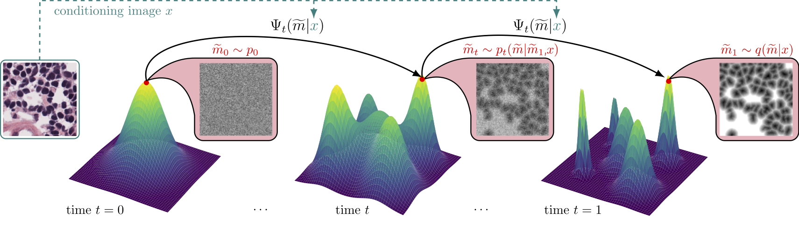

# FlowSDF: Flow Matching for Medical Image Segmentation Using Distance Transforms

**International Journal of Computer Vision (IJCV)**, 2025

This repository contains the official implementation of the paper:
[**FlowSDF: Flow Matching for Medical Image Segmentation Using Distance Transforms**](https://link.springer.com/article/10.1007/s11263-025-02373-y)

[Lea Bogensperger](https://leabogensperger.github.io), [Dominik Narnhofer](https://scholar.google.com/citations?user=tFx8AhkAAAAJ&hl=en), [Alexander Falk](https://scholar.google.com/citations?user=kdzT5mgAAAAJ&hl=en&oi=ao), [Konrad Schindler](https://scholar.google.com/citations?user=FZuNgqIAAAAJ&hl=en&oi=ao), [Thomas Pock](https://scholar.google.com/citations?user=FwNaHxQAAAAJ&hl=en&oi=ao)




## 🔧 Getting Started

### 📁 Data Preprocessing
Preprocess your data following the structure used in [generative-segmentation-sdf](https://github.com/leabogensperger/generative-segmentation-sdf), particularly the notebook `/preprocess_data/precompute_sdf.ipynb`.
Ensure that precomputed SDF masks and images are saved in a directory containing `train.csv` and `test.csv`.

Update the data_path in the config file under the general section to point to this directory.


### 🚀 Running the Code
Clone the repository (including submodules):
```bash
git clone --recurse-submodules git@github.com:leabogensperger/FlowSDF.git
```

Use `main.py` to start training via trainer.py.
Use `sampler.py` to generate SDF-based segmentation masks from images listed in test.csv.
Make sure to specify the model and checkpoint to be used in the config script.

```bash
# 1. Create and activate the environment
conda create -n flowsdf-env python=3.11
conda activate flowsdf-env
pip install -r requirements.txt

# 2. Run the training code for MoNuSeg
python main.py --config "cfg/monuseg.yaml",

# 3. Sampling from this trained model 
python sampler.py --config "cfg/monuseg.yaml"

```


## Citation

If you find our work helpful, please consider citing:

```bibtex
@article{bogensperger2025flowsdf,
  title={FlowSDF: Flow matching for medical image segmentation using distance transforms},
  author={Bogensperger, Lea and Narnhofer, Dominik and Falk, Alexander and Schindler, Konrad and Pock, Thomas},
  journal={International Journal of Computer Vision},
  pages={1--13},
  year={2025},
  publisher={Springer}
}